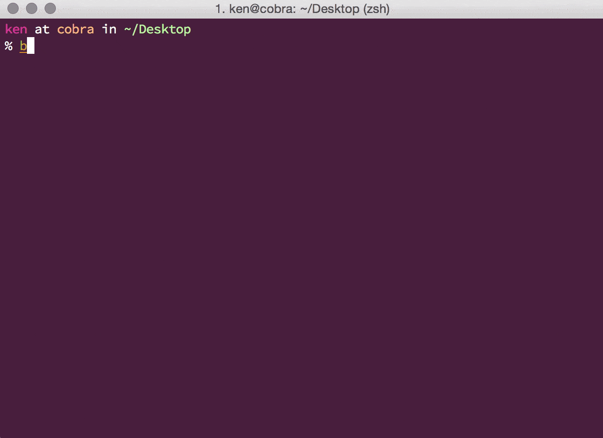

============
homebrew-trr
============

.. image :: https://travis-ci.org/wkentaro/homebrew-trr.svg
  :alt: Build Status
  :target: https://travis-ci.org/wkentaro/homebrew-trr

.. image :: https://img.shields.io/badge/trr-22.0.99.5-blue.svg
  :alt: Trr Version
  :target: https://code.google.com/p/trr22/

This repository contains TRR (typing software on Emacs) **English Version** as formula for
`Homebrew <https://github.com/Homebrew/homebrew>`_.

Current Versions
================
* trr 22.0.99.5

Installing homebrew-trr formula
===============================
It's simple like below:

.. code-block :: sh

  $ brew tap wkentaro/trr
  $ brew install wkentaro/trr/trr

  # after the installation, play trr
  $ emacs -f trr

To install via URL:

.. code-block :: sh

  $ brew install https://raw.github.com/wkentaro/homebrew-trr/master/trr.rb

Screencast of installation:

Docs
====

``brew help``, ``man brew`` or see the Homebrew `wiki <http://wiki.github.com/mxcl/homebrew>`_.

